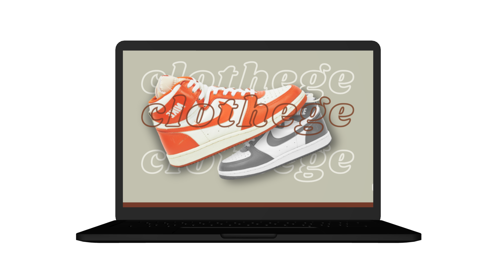

# API de e-commerce
Este proyecto es la parte backend de un e-commerce de zapatillas vintage para el Proyecto Final del curso de ___Backend___ junto con su proyecto de [frontend](https://github.com/camyael/clothege).

* [Demo de la api](https://api-ecommerce-camyael.up.railway.app/api/products)
* [Demo de la página](https://clothege.netlify.app)



## Características
* Carrito
* Catálogo de Compra
* Registro
* Login
* Recuperación de contraseña

## Tecnologías utilizadas
* Node JS
* Mongo DB
* Bcrypt
* Cors
* Cookie-parser
* Dotenv
* Express
* Jsonwebtoken
* Mongoose
* Multer
* Modemailer
* Socket.io
* Swagger-jsdoc
* Swagger-ui-express
* Twilio

## Creación e Instalación:

Este proyecto se inició con Node JS.

Para acceder al proyecto, deberás ejecutar en la consola:
````
$ git clone https://github.com/camyael/api-ecommerce.git
````

Antes de iniciar el proyecto, primero deberás modificar el archivo .env.example a .env con las credenciales correctas.
Para instalar las dependencias, en el directorio del proyecto ejecute: 
````
$ npm install 
$ npm run dev
````

## Autor
* Camila Villaverde — [LinkedIn](https://www.linkedin.com/in/camilavillaverde/) y [Portfolio](https://camyael.github.io/portfolio/)